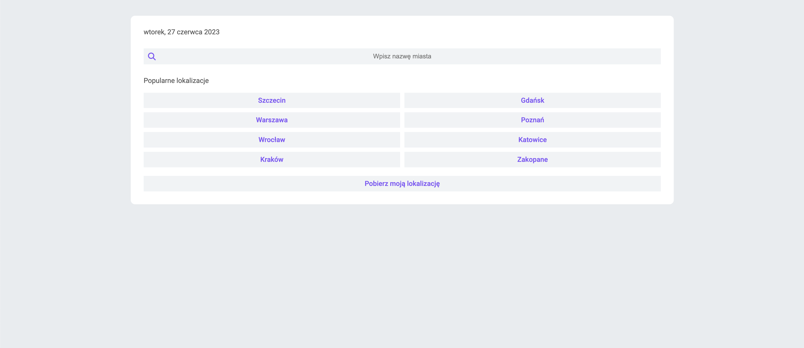
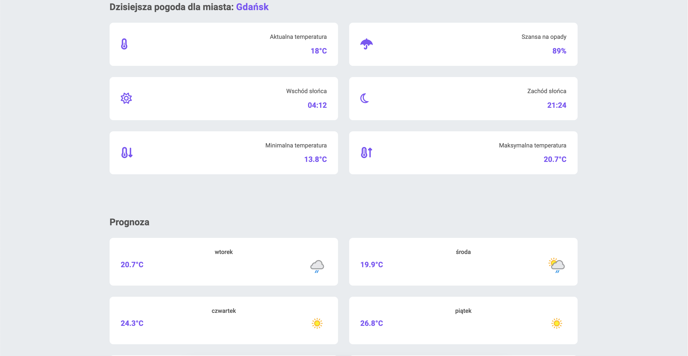
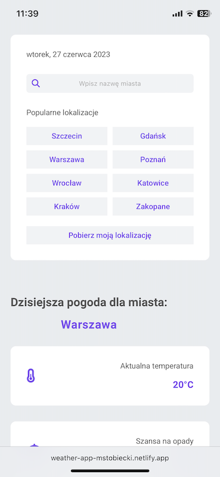

<h4 align="center">🌧 Weather app</h4>

## Project Overview 🎉

A weather application using the MVC pattern. The site displays the current weather for the selected locality - temperature, minimum temperature, maximum temperature, probability of precipitation, sunrise and sunset. In addition, a forecast for the next 8 days is included.

The application uses Moment.js, MVC, Geolocation and Parcel libraries. 

## Tech/framework used 🔧

## Screenshots 📺

    

   

## Installation 💾

`git clone https://github.com/mstobiecki/weather.git`

And run: npm run start

## Available scripts

| Command         | Description            |     |
| --------------- | ---------------------- | --- |
| `npm run start` | Open local server      |     |
| `npm run build` | Create optimized build |     |

## Live 📍

https://weather-app-mstobiecki.netlify.app/
